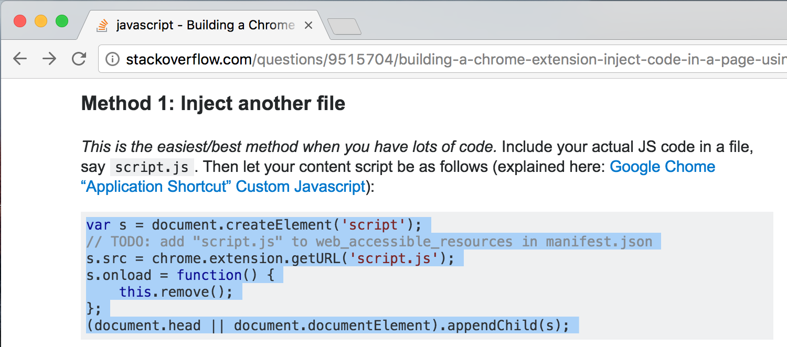

# Stack Overflow Breadcrumbs

We've all done it. You've got a programming question, you dump it into Google, and you find the exact incantation that you need to fix it. You copypaste it from StackOverflow and life is good. But what happens two days later? You have no idea why that code is there or what it does.

Stack Overflow Breadcrumbs hooks the copy event and adds a link back to where you found the code. So when you copy and paste this code block:




This is what comes out of your paste buffer on the other side:

```js
// from: https://stackoverflow.com/questions/9515704/building-a-chrome-extension-inject-code-in-a-page-using-a-content-script#9517879
var s = document.createElement('script');
// TODO: add "script.js" to web_accessible_resources in manifest.json
s.src = chrome.extension.getURL('script.js');
s.onload = function() {
    this.remove();
};
(document.head || document.documentElement).appendChild(s);
```

## Features

* The extension bootstraps language inference from StackOverflow's pretty print library (which itself simply trusts the tags added to the question). This way a question tagged with python will have `#` as its comment character, and a quesiton tagged with C will have `//` as the comment character. It's not perfect, but it works decently. Feel free to submit a PR to add more languages. If you copy text from outside of a `code` block, there's no comment character.
* If you copy text from an answer, the extension adds the fragment identifier for that answer to the URL so that you can jump right back to where you found the code.

## TODOs

* Suppress header for super short pastes (less than two newlines?)
* Any sort of customization
* Better language inference
